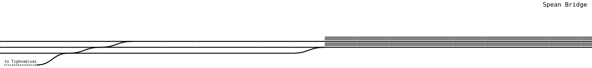

# Go Infinite Rail Generator

The Go Infinite Rail Generator procedurally generates a *one-dimensional* rail word. 



The generator uses [Perlin Noise](https://en.wikipedia.org/wiki/Perlin_noise) to achieve a smooth
distribution of tracks. It generates the world tile-wise. The above image consists of six tiles next
to each other. A tile represents 100m of track. This results in a possible world size of 19 times the earth's equatorial perimeter.

Currently, the generator is work in progress and will be improved by adding more structures and details
to the generation algorithm.

## Content

1. [Features](#features)
2. [Build Instructions](#build-instructions)
3. [Optional Prerequisites](#optional-prerequisites)
5. [Run a Tile Server](#run-a-tile-server)
4. [Custom Town Names](#custom-town-names)

## Features

**Generated structures**

* variable amount of tracks
* areas with many tracks (e.g stations) and over-land tracks with only one or two tracks.
* switches when tracks merge or diverge
* siding tracks
* station platforms with station names

**Architecture**

* Command-Line Tool to render a certain tile as SVG
* An OSM tile server to display the world like OSM maps
* A simple web app to display the generated world dynamically

## Build instructions

You can either download the binaries from the Release tab (currently Linux only), or build the application from scratch.

### Requirements

* Go 1.16 or higher
* npm 6.14.13 (only needed if you want to build the minimalistic Angular Frontend)

### Only Go Application

If you just want to render SVG tiles locally, or running the tile server, it suffices to execute

```
go build cmd/rail-generator.go
```

### Go Application and Web Frontend

If you want the minimalistic web frontend, too, just execute the command

```
/bin/bash build.sh
```

It compiles both the Go application and the frontend and puts everything in a directory `dist`. If you cannot execute
bash, the manual steps are:

1. Build the Angular app: `npm run-script build`
2. Rename the `dist` directory into `html`.
3. Put the [generated Go file](#only-go-application) into the same directory as the `html` directory.


## Render a single tile

The following command renders a single tile to the standard output:

`rail-generator [--seed=SEED] [--towns=TOWNS] svg [--tile=TILE] [--size=SIZE]`

If a seed is given, then subsequent executions of the command will produce the same rail world. The
`tile` flag signifies which tile of the world is rendered, it defaults to "0". The `size` is the size of the SVG in
pixel and is 200 pixel as default.

## Run a tile-server

To run a tile server, execute the following command:

`rail-generator [--seed=SEED] [--towns=TOWNS] serve [--bind=BIND] [--port=PORT] [--shift=SHIFT]`

The seed has the same function as in the [rendering usecase](#render-a-single-tile). The flags `bind` and
`port` define how the tile server is reachable. If they are omitted, the server binds to *127.0.0.1:9551*.

The `shift` flag is a number which is added onto the *x* coordinate on each request to the tile server. The default is
-131068. If you use a library like [Leaflet](https://leafletjs.com/) or [Openlayers](https://openlayers.org/) to display the tiles, the library will request the tile *
x=121068, y=131072* at coordinates *longitude=1, latitude=0.00138* with *zoom=18*. Thus, via shifting, the map shows the
first world tile at these coordinates near the origin.

The command runs a server with three endpoints:

* `GET /tiles?tile={x}&vertical={y}&seed=${seed}` Returns the *x-shift* world tile. Since the generated world is
  one-dimensional, the endpoint returns an empty SVG for values of *y* other than 131072. Since this value is near the
  equator, the maximal size of the world is used. The seed request parameter allows to overwrite the default seed (see
  progam flags) temporarily for the request.
* `GET /config` Returns a JSON file of the format `{"defaultSeed":"defaultSeed"}`.
* `GET /` (and any other endpoint) Can be used in browsers to download a minimalistic web app. This app utilizes Leaflet
  to explore the world.
  
The tile server is configured to allow CORS requests.

## Custom Town Names

If the `towns` flag is not set, the program uses a simple list of the 25 biggest towns
of Europe for naming the stations. If you want to use custom town names, you can set the `towns` flag
to a text file containing a list of town names, one in each line. These names will be assigned
randomly to the generated stations.

To simply create a list of town names of a certain geographic area, you can
issue the following Overpass Turbo query at [Overpass Turbo](https://overpass-turbo.eu/):

```
[out:csv('name';false)][timeout:25];
(
  node["place"="town"]({{bbox}});
  node["place"="village"]({{bbox}});
  node["place"="city"]({{bbox}});
);
out body;
>;
out skel qt;
```

The result is a list of all town, village, and city names in the currently visible
map.

## License

MIT. See [License](LICENSE).